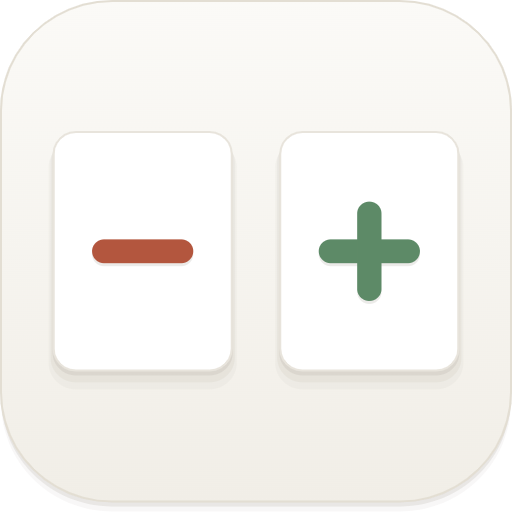

# ztools-plugin-diffffff

<div align="center">



**一个 ZTools 文本差异对比插件，把两段文本的 diff 做成纯本地离线运行的「对比工作台」**

_并排 / 统一视图 · 智能精度 · 行内高亮 · 语法高亮 · 自定义忽略规则 · 历史记录_

[](./public/plugin.json)
[](#-平台与限制)
[](https://github.com/ZToolsCenter/ZTools)

</div>

## 📸 预览

<div align="center">
  <table>
    <tr>
      <td colspan="2" align="center">
        
        <p><i>对比工作台 - 并排视图 / 行内高亮 / 折叠未变更行 / hunk 级合并</i></p>
      </td>
    </tr>
  </table>
</div>

---

## ✨ 特性

- 🔍 **四种对比精度** - 智能（默认）/ 行级 / 单词 / 字符。智能档以行级为骨架、变化行内自动做词级高亮；基于 CJK 感知切词，中文也能精确到字标注；切换精度基于同一输入的缓存重投影，不重算原始 diff
- 🪟 **并排 / 统一双视图** - 左右逐行对照或单栏统一视图一键切换，行号列宽随结果行数自适应
- 🎨 **语法高亮** - 基于 CodeMirror 语言包，覆盖 JSON / JavaScript / TypeScript / Python / Go / Java / C++ / SQL / YAML / Markdown / HTML / CSS / XML 等，可按扩展名与内容自动检测语言
- ⚙️ **灵活的忽略规则** - 忽略空白 / 忽略大小写 / 忽略空行变化三个开关，外加自定义正则忽略规则（编辑期合法性校验，可启停、可备注），比较与行内高亮共用同一套规范化语义
- 📦 **折叠未变更行** - 只呈现差异 hunk 与上下文行（0-10 行可调），「⋯ 展开未更改的 N 行」按需展开，也可一键全部展开 / 收起
- 🧭 **差异导航与统计** - F3 / Shift+F3 循环跳转下一处 / 上一处差异，工具栏实时显示 +N −M 与差异处数
- ⇄ **hunk 级合并** - 每个差异块提供「应用到左侧 / 应用到右侧」，按冲突取侧语义把一侧内容合并进另一侧，改完可直接复制
- 📜 **历史记录** - 对比结果自动落盘 `ztools.dbStorage`（最多 100 条），支持关键词搜索、恢复到输入区与删除，自动保存可关
- 📥 **多种载入方式** - 打开文件 / 拖拽文件 / 剪贴板粘贴，按 UTF-8 / GBK / UTF-16 编码读取（BOM 自动剥除），覆盖前弹确认
- 🗂️ **示例数据** - 内置中文文案与代码两组精心构造的示例，一键载入即可体验行内高亮与折叠等全部能力
- 🔒 **纯本地离线** - 全部对比计算在本地完成，不联网、不上传任何文本；设置与历史按插件命名空间隔离存入 `ztools.dbStorage`

## 🚀 快速开始

> 本插件是纯前端 ZTools 插件，无原生模块依赖；请先安装 [ZTools](https://github.com/ZToolsCenter/ZTools) 宿主。

### 安装依赖

```bash
npm install
```

### 开发调试

```bash
npm run dev        # Vite 开发服务器（http://localhost:5173，与 plugin.json 的 development.main 一致）
```

### 构建

```bash
npm run build      # vue-tsc 类型检查 + vite build，产物在 dist/
npm test           # Vitest 单元测试（core / ui / preload 全量）
npm run test:e2e   # 先 build 再跑 Playwright 端到端测试
node scripts/bench-diff.mjs   # diff 引擎基准测试（可选）
```

### 使用

1. 在 ZTools 中加载本插件（开发者模式导入项目目录或 dist 产物）
2. 主搜索框输入 `diff` 或 `文本差异` 进入对比工作台
3. 左右两侧粘贴 / 打开 / 拖入文本，点「对比」（⌘/Ctrl+Enter），结果页可随时「重新编辑」返回

## 🧩 功能详解

本插件提供**一个 feature**：`code: diff` — 文本对比工作台。

### 进入方式

`text` 型 cmd（`diff` / `文本差异`），可被主搜索框搜索命中，进入即见「输入 → 对比」工作台，侧边栏顶部可切「文本对比 / 历史」。

### 输入区

- 左右双栏 CodeMirror 编辑器，各自带字符数 / 行数统计与编码选择（UTF-8 / GBK / UTF-16）
- 每侧支持三种载入：打开文件（切换编码可重读，已有内容时覆盖前弹确认）、剪贴板粘贴、拖拽文件
- 侧头部一键复制该侧内容；主工具栏提供对比 / 重新编辑（⌘/Ctrl+Enter）、清空两侧、交换左右、全部展开、设置
- 「示例数据」下拉一键载入内置示例，无需自备素材

### 结果视图

- **并排 / 统一**两种视图形态，行号列宽随总行数位数自适应；「折叠未变更」「自动换行」可开关
- **行内高亮**：变化落到词 / 字（CJK 感知切词），修改行两侧双向标注，忽略选项下仍展示原文、只按规范化结果判定等价
- **差异导航**：上一处 / 下一处（F3 / Shift+F3）循环跳转，当前 hunk 高亮定位
- **hunk 级合并**：「← 应用到左侧 / 应用到右侧 →」按取侧语义整段替换对应区间，不可变实现，随时重新编辑
- **统计**：+N −M 与差异处数徽标，整侧复制时悬浮展示字符变化量
- **大文本保护**：单侧 5MB / 10 万行上限（超限给出错误提示与定位），结果区虚拟滚动

### 侧边栏（对比选项）

- 忽略空白 / 忽略大小写 / 折叠未变更 / 换行开关
- 视图模式（并排 / 统一）、对比精度（智能 / 行级 / 单词 / 字符）
- 语法高亮语言（自动检测或手动指定）、示例数据载入

### 设置弹窗

- **上下文行数**（0-10）：控制每个 hunk 前后保留的未更改行数
- **自定义忽略规则**：正则 pattern + flags（默认 `g`）+ 启用开关 + 备注，编辑期即校验合法性，非法正则不进入对比；适合忽略时间戳、日志前缀等噪声
- **自动保存历史**：关闭后不再自动记录，已保存的历史仍可查看、恢复与删除

### 历史记录

- 对比成功后自动存入 `ztools.dbStorage`（最多保留 100 条），设置持久化带版本迁移
- 支持按关键词搜索、一键恢复到输入区、单条删除

> 💡 **关于 cmd 类型**：`text` 型 cmd 是唯一能进入 ZTools 主搜索列表的 cmd 类型。本插件的 `diff` feature 即以此声明，保证「能被搜到且能打开」。

## 🛠️ 技术栈

- **框架**: Vue 3 + TypeScript + Vite
- **UI**: ztools-ui（与宿主一致的组件库）+ reka-ui + lucide-vue-next（图标）
- **编辑器**: CodeMirror 6（官方语言包提供输入体验与语法高亮）
- **Diff 引擎**: 基于 [jsdiff](https://github.com/jsdiff/jsdiff) 封装的纯函数引擎层（`src/core`，零 UI / 零 DOM / 零 store 依赖，逐模块单测）
- **测试**: Vitest（core / ui / preload 单测）+ Playwright（端到端）

## 📁 项目结构

```
ztools-plugin-diffffff/
├── public/
│   ├── plugin.json              # 插件元信息与 feature（code: diff）声明
│   ├── preload/services.js      # 宿主能力适配：按编码读文件 / 打开文件对话框 / 剪贴板 / dbStorage
│   └── logo.png / logo.svg
├── src/
│   ├── App.vue                  # 工作台容器：输入区 / 工具栏 / 结果视图 / 侧边栏 / 快捷键
│   ├── main.ts / main.css
│   ├── components/
│   │   ├── InputEditor.vue      # 单侧 CodeMirror 编辑器（编码 / 打开 / 粘贴 / 复制）
│   │   ├── SplitDiffView.vue    # 并排视图
│   │   ├── UnifiedDiffView.vue  # 统一视图
│   │   ├── PaneHeader.vue       # 侧头部（字符行数 / 编码 / 载入 / 复制）
│   │   ├── HistoryPanel.vue     # 历史记录面板（搜索 / 恢复 / 删除）
│   │   ├── SettingsDialog.vue   # 设置弹窗（上下文行数 / 忽略规则 / 历史开关）
│   │   └── ui/                  # UiButton / UiModal / UiSwitch / UiSelect / ... 基础组件
│   ├── composables/             # useFileLoad / useDropLoad / useClipboardLoad / useCopy / useToast / ...
│   ├── core/                    # diff 引擎纯函数层（零 UI / 零 DOM / 零 store 依赖）
│   │   ├── diff.ts / align.ts / pairing.ts / inline.ts / tokenizer.ts    # 行级 diff、修改配对与行内高亮
│   │   ├── hunks.ts / precision.ts / options.ts / ignoreRules.ts         # hunk 投影 / 精度缓存 / 忽略选项
│   │   ├── highlight.ts / langdetect.ts                                  # 语法高亮与语言自动检测
│   │   └── merge.ts / stats.ts / historyModel.ts / settingsModel.ts / guards.ts / normalize.ts / types.ts
│   ├── stores/                  # workbench / diff / view / settings / history / nav（组合式 reactive 单例）
│   └── data/samples.ts          # 内置示例数据
├── tests/
│   ├── core/                    # 引擎逐模块单测 + 集成测试
│   ├── ui/                      # 视图层纯逻辑单测（虚拟滚动 / 导航 / 列宽…）
│   ├── preload/                 # services 单测
│   └── e2e/                     # Playwright 端到端测试
├── scripts/
│   └── bench-diff.mjs           # diff 引擎基准测试
└── package.json
```

## 📋 平台与限制

| 功能 | Windows | macOS | Linux |
| --- | :---: | :---: | :---: |
| 文本对比（全部功能） | ✅ | ✅ | ✅ |
| 文件载入 / 剪贴板 / 历史记录 | ✅ | ✅ | ✅ |

- 本插件为**纯前端实现**（Vue 渲染 + preload 侧 Node 能力适配），无任何原生模块，全平台行为一致
- **输入上限**：单侧 5MB 或 10 万行（任一维度超限即停止对比并提示侧别），编辑器本身不设限
- **编码白名单**：UTF-8 / GBK / UTF-16 / UTF-16BE，BOM 自动剥除；GBK 遇非法字节按标准以 U+FFFD 呈现（不抛错，可换编码重读）
- 对比精度切换基于同一输入缓存重投影；历史与设置按插件命名空间隔离存入 `ztools.dbStorage`

## 🐛 问题反馈

遇到问题？请在 [Issues](https://github.com/Particaly/ztools-plugin-diffffff/issues) 中反馈。

提交 Issue 时请包含：

- 操作系统版本
- 插件版本
- 复现步骤
- 出错的文本样本（如有，注意脱敏）

## 💝 致谢

- [diff (jsdiff)](https://github.com/jsdiff/jsdiff) - 文本 diff 算法基础
- [CodeMirror](https://codemirror.net/) - 代码编辑器与语法高亮
- [ZTools](https://github.com/ZToolsCenter/ZTools) - 插件宿主与 API
- [ztools-ui](https://www.npmjs.com/package/ztools-ui) - 与宿主一致的组件库
- [Vue.js](https://vuejs.org/) - 渐进式 JavaScript 框架
- [Vite](https://vite.dev/) - 下一代前端构建工具

## 📄 许可证

本项目尚未附带开源许可证（仓库暂无 LICENSE 文件），如需二次开发或分发请先联系作者。

---

<div align="center">

**如果这个插件对你有帮助，请给个 Star ⭐️**

</div>
