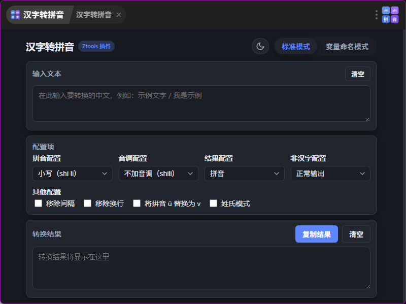

# 汉字转拼音（Hanzi to Pinyin）


Ztools 插件：把中文汉字转换成拼音，支持**标准模式**与**变量命名模式**两大类共十余种输出形态。

> 关键词：拼音 / pinyin / 汉字转拼音 / 罗马化 / 变量命名

---

## 功能特性

- **标准模式**
  - 拼音配置：小写 / 大写 / 首字母大写
  - 音调配置：不加音调 / 拼音符号（shì lì）/ 数字（shi4 li4）
  - 结果配置：拼音 / 首字母 / 声母 / 韵母 / 音调
  - 非汉字配置：正常输出 / 空格替代 / 下划线替代 / 移除非汉字字符
  - 其他：移除间隔、移除换行、将拼音 ü 替换为 v、姓氏模式（多音字优先取姓氏读音）
- **变量命名模式**：小驼峰、大驼峰、下划线、常量名、短横杠、空格、首字母小写 / 大写 / 小驼峰 / 大驼峰
- **输入即匹配**：在 Ztools 搜索框输入任意含汉字的内容即匹配本插件，进入后自动填入并转换
- **配置记忆**：自动保存并恢复上次使用的模式与各项配置
- **深色模式**：右上角（模式切换左侧）太阳 / 月亮按钮一键切换，偏好持久化

---

## 截图

> 把插件运行截图放进 `screenshots/` 文件夹，再替换下面的路径即可。




---

## 标准模式示例

| 配置       | 输入 | 输出         |
| -------- | -- | ---------- |
| 小写 / 无调  | 示例 | `shi li`   |
| 小写 / 符号调 | 示例 | `shì lì`   |
| 小写 / 数字调 | 示例 | `shi4 li4` |
| 大写 / 无调  | 示例 | `SHI LI`   |
| 声母       | 示例 | `sh l`     |
| 韵母+数字调   | 绿  | `v4`       |
| 姓氏模式     | 单于 | `shan yu`  |

## 变量命名模式示例

| 格式    | 输入「我是示例」        |
| ----- | --------------- |
| 小驼峰   | `woShiShiLi`    |
| 大驼峰   | `WoShiShiLi`    |
| 下划线   | `wo_shi_shi_li` |
| 常量名   | `WO_SHI_SHI_LI` |
| 短横杠   | `wo-shi-shi-li` |
| 首字母大写 | `WSSL`          |

---

## 使用方式

1. 在 Ztools 中加载本插件（开发者模式或插件市场安装）。
2. 顶部输入框输入中文，中间选择模式与配置，下方实时显示结果。
3. 也可直接在 Ztools 主搜索框输入中文，命中本插件后自动带入文本。
4. 点击结果区「复制」按钮复制到剪贴板。

---

## 目录结构

```
hanzi-to-pinyin/
├── plugin.json        # 插件元信息与功能指令
├── preload.js         # 预加载桩（纯前端，无 Node API）
├── index.html         # 插件界面
├── index.css          # 样式（含深色模式变量）
├── index.js           # 界面逻辑 + 配置记忆 + 深浅色切换
├── converter.js       # 纯函数转换核心（可在 Node 下单测）
├── logo.png           # 插件图标（圆角四格 pīn / yīn / 拼 / 音）
├── vendor/
│   └── pinyin-pro.js  # 浏览器打包版 pinyin-pro（已 esbuild 单文件化）
├── README.md
├── CHANGELOG.md
└── screenshots/       # 截图
```


---

## 技术说明

- 转换基于 [`pinyin-pro`](https://github.com/zh-lx/pinyin-pro)，已用 esbuild 打包为单文件 `vendor/pinyin-pro.js`，**无需 npm 安装、无需联网**即可运行。
- 核心转换逻辑集中在 `converter.js`，与 UI 解耦，便于测试与复用。

---

## 作者

SZYPXJ
