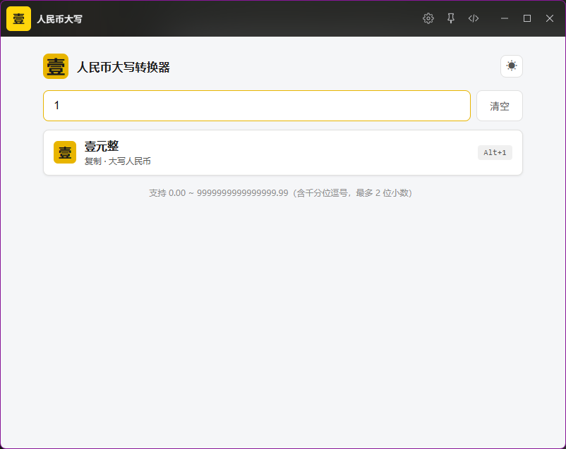
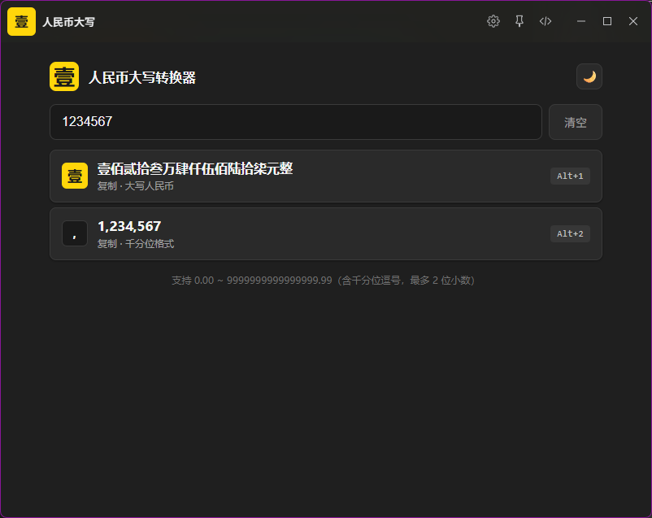
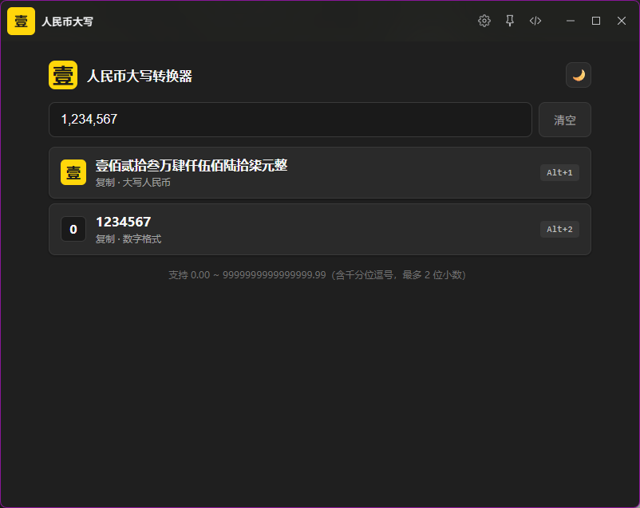

# 人民币大写 · （rmb-capitalized）


[ZTools](https://github.com/ZToolsCenter/ZTools)插件：将阿拉伯数字转换为人民币大写金额，支持数字、千分位格式化互转。结果带「整」字。（精确到元或角时加，含分时不加）

> 关键词：数字 / 人民币 / 金额 / 大写 / 千分位 / 格式

## 功能特性

### 1. 主搜索快速转换（直接匹配）

在 Ztools 主搜索框中输入符合规范的数字或千分位格式数字（最多 16 位整数、最多 2 位小数、可含千分位逗号），会**直接匹配**并转换为人民币大写并关闭主界面弹出通知。

### 2. 进入插件 UI

在 Ztools 输入关键词「**人民币大写**」或「**RMB**」进入插件主界面：

- **顶部输入框**：实时显示转换结果
- **清空按钮**：一键清空输入并重置结果
- **主题切换按钮**（标题栏右侧）：点击切换深色 / 浅色主题，记忆到 localStorage；首次进入跟随系统
- **第 1 行**：人民币大写（点击复制 / `Alt+1` / 回车）
- **第 2 行**：另一种格式「数字/千分位」（点击复制 / `Alt+2`）

### 3.支持的数字格式（与正则一致）：

- 0.00 ~ 9999999999999999.99（含千分位逗号，最多 2 位小数）

```
^(\d{1,16}|\d{1,3}(?:,\d{3}){1,4}|\d(?:,\d{3}){5})(?:\.\d{1,2})?$
```

正则三段式说明：
- `\d{1,16}`：1-16 位纯数字
- `\d{1,3}(?:,\d{3}){1,4}`：整数 ≤ 15 位带千分位（首位 1-3 位 + 1-4 段三位）
- `\d(?:,\d{3}){5}`：恰好 16 位带千分位（首位 1 位 + 5 段三位）

例：`123`、`1234`、`1,234`、`1234.56`、`1234567`、`9,999,999,999,999,999`

> ✗ 会被拒绝：`11,222,333,444,555,666`（18 位）、`12,222,333,444,555,666`（17 位）

### 4. 加"整"规则

如下：

| 情形 | 结果 | 是否加「整」 |
| --- | --- | --- |
| 金额精确到元（如 `100`、`123.00`） | `壹佰元整`/`壹佰贰拾叁元整` | **加** |
| 金额精确到角（如 `100.5`、`0.10`） | `壹佰元伍角整`/`零元壹角整` | **加** |
| 金额包含分（如 `100.55`、`0.05`） | `壹佰元伍角伍分`/`零元零伍分` | **不加**（财务规范禁止） |

## 界面截图

> 把截图放进 `screenshots/` 文件夹，再替换下面的路径即可。  

| 浅色模式 · 主界面 | 深色模式 · 主界面 |
| --- | --- |
|  |  |

| 主搜索直接匹配 | 千分位反向输出 |
| --- | --- |
|  |  |

## 发布到官方插件市场

官方市场即中心仓库 [`ZToolsCenter/ZTools-plugins`](https://github.com/ZToolsCenter/ZTools-plugins)。`ztools publish` 不会上传安装包，而是自动 **fork 中心仓库 → 开 Pull Request → 审核合并后上架**。

###  1. 准备工具

| 工具 | 说明 | 获取方式 |
| --- | --- | --- |
| Node.js | ≥ 18 | [nodejs.org](https://nodejs.org) |
| npm | 随 Node 自带 | — |
| Git | 用于本地仓库与提交 | [git-scm.com](https://git-scm.com) |
| GitHub 账号 | 用于 OAuth 授权与 fork | 免费注册 |
| `@ztools-center/plugin-cli` | 发布命令行工具（命令名 `ztools`） | `npm install -g @ztools-center/plugin-cli` |

### 2. 确认 `plugin.json` 必填字段

发布校验会检查以下字段（本插件均已满足）：

| 字段 | 必填 | 本插件值 |
| --- | --- | --- |
| `name` | 是（即插件 ID，决定 `plugins/<name>/` 路径） | `rmb-capitalized` |
| `title` | 是 | 人民币大写 |
| `main` | 是（入口 HTML） | `index.html` |
| `logo` | 是（png / jpg） | `logo.png` |
| `preload` | 是 | `preload.js` |
| `version` / `author` / `description` / `features` | PR 模板使用，建议齐全 | 已具备 |

> 字段完整说明见 [plugin.json 配置文档](https://ztoolscenter.github.io/ZTools-doc/plugin-json.html)。

### 3. 初始化 Git 仓库

```bash
cd rmb-capitalized
git init
git add .
git commit -m "feat: 人民币大写插件 v1.0.0"
```

> 工作区必须干净（无未提交改动），否则发布会被拒绝。

### 4. 执行发布

```bash
ztools publish
```

首次运行会：

1. 自动打开浏览器进行 **GitHub OAuth 授权**（默认申请 `workflow` 权限，因中心仓库含 Actions 工作流）；
2. Token 保存到 `~/.config/ztools/cli-config.json`；
3. 自动 fork `ZToolsCenter/ZTools-plugins`、创建分支 `plugin/rmb-capitalized`；
4. 复制插件文件（自动忽略 `node_modules`、`dist`）到 `plugins/rmb-capitalized/`，本地打标签 `ztools-last-publish`；
5. 推送并向中心仓库开一个 **draft PR**。

> 本仓库的 `README.md`、`converter_test.js`、`screenshots/` 也会随 PR 提交，这是源码仓库的正常内容；若希望市场副本仅含运行文件，可在提交前用 `.gitignore` 排除这些开发文件。

### 5. 到 GitHub 完善 PR

打开 CLI 输出的 PR 链接，建议补充：

- 界面截图（见上文「界面截图」，已放进 `screenshots/`）；
- 勾选 PR 模板里的自检清单；
- 将 PR 由 Draft 切为 **Ready for review**。

审核合并后，插件即出现在官方市场。

### 6. 发布新版本

修改代码后，仅更新 `plugin.json` 的 `version` 并提交，再次执行：

```bash
# 改完代码后
git add .
git commit -m "fix: ..."
ztools publish
```

CLI 会识别为更新（上游已存在 `plugins/rmb-capitalized/`），在分支末尾追加提交并复用 / 新建 PR，不会 force-push。

### 7. 常见错误

| 现象 | 原因 | 解决 |
| --- | --- | --- |
| `refusing to allow an OAuth App to ... workflow` | Token 缺 `workflow` scope | `rm ~/.config/ztools/cli-config.json` 后重跑 `ztools publish` |
| `merge-upstream` 返回 422 | fork 的 main 偏离上游 | `rm -rf ~/.config/ztools/ZTools-plugins` 后重跑；或手动 `git reset --hard upstream/main` |
| `工作区存在未提交的改动` | 有未 commit 的文件 | `git commit` 或 `git restore` |
| 远端分支有本地没有的新 commit（审核者直推） | 审核改动已合入 | `ztools pull-contributions` → 解决冲突 → `ztools publish` |

完整流程见 [ZTools 发布与协作文档](https://ztoolscenter.github.io/ZTools-doc/publish-and-update.html)。

## 文件结构

```
rmb-capitalized/
├── plugin.json          # 插件元数据（名称 / 作者 / 关键词 / features）
├── preload.js           # Node.js 桥：onMainPush + onPluginEnter
├── index.html           # 插件 UI 入口
├── index.css            # 样式（深/浅色主题自适应）
├── index.js             # UI 交互逻辑（行点击 / 快捷键 / 清空 / 主题切换）
├── converter.js         # 纯函数：RMB 大写 + 千分位（加整，上限 16 位整数）
├── converter_test.js    # 单元测试（node converter_test.js）
├── logo.png             # 黄底黑字"壹"图标
├── screenshots/         # 截图文件夹
├── CHANGELOG.md
└── README.md
```

## 开发与测试

### 单元测试

```bash
node converter_test.js
```

覆盖：整数 / 小数 / 含千分位输入 / 0 / 大数字（亿、兆）/ 加"整"规则 / 千分位格式化边界等 **70+** 用例（当前 **72** 个，全部通过）。

### 调试 UI

直接用浏览器打开 `index.html`（或在 ZTools 开发者模式下加载），输入数字即可看到实时结果。复制功能会优先调用 `window.ztools.copyText`，未检测到 ZTools 环境时自动 fallback 到 `navigator.clipboard`。

## 元数据

| 字段 | 值 |
| --- | --- |
| name | `rmb-capitalized` |
| title | 人民币大写 |
| author | `SZYPXJ` |
| keywords | `人民币大写`、`RMB`、`大写`、`金额`、`数字转中文` |
| 正则 | `/^(\d{1,16}|\d{1,3}(?:,\d{3}){1,4}|\d(?:,\d{3}){5})(?:\.\d{1,2})?$/` |
| 平台 | Windows / macOS / Linux |

## 作者

SZYPXJ

## License

MIT
